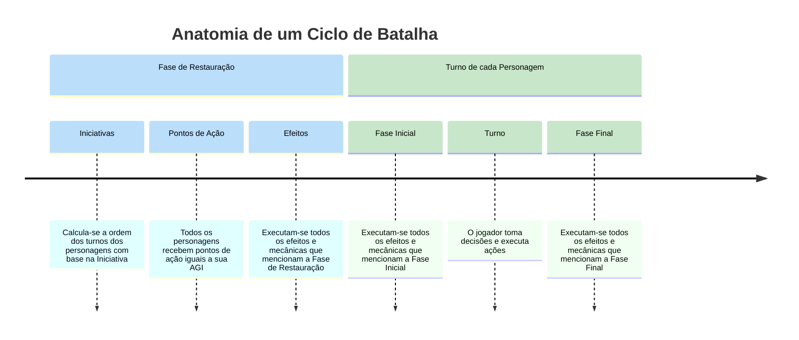

!!!danger
Esta seção ainda não foi completamente revisada. Algumas informações podem estar desatualizadas ou incompletas, e a formatação pode não estar finalizada.
!!!
    
# Rodadas e Turnos

Este é um jogo de turnos, isso quer dizer que cada jogador realiza suas jogadas e então passa a vez para o próximo jogador.

---

## Rodada
Uma rodada é composta pela sequência de turnos de todos os personagens. Quando todos os personagens terminarem seus turnos em ordem, tem início uma nova rodada.

Uma rodada tem início e fim.

### Início da Rodada

Nesta fase é determinado a ordem dos turnos dos personagens nesta rodada.
A ordem em que cada personagem joga é definida pela PER de cada um de forma decrescente. Quando personagens tiverem a mesma PER, eles desempatam entre si rolando 1d6. Caso empatem novamente, rola-se novamente entre os empatados até um desempate.

### Fim da Rodada
Esta fase acontece quando o último personagem na ordem de turnos encerrar seu turno. Aplica-se quaisquer efeitos que mencionem esta fase e então procede-se para o início da próxima rodada.

---

## Turno
O turno de um personagem é composto por 3 fases em sequência.

### Início do Turno
Compõe o momento em que o turno de um personagem começa, antes que ele possa agir. Neste momento são aplicados todos os efeitos e mecânicas que especificam “No início do seu turno”.

### Durante o Turno
Nesta fase o personagem recebe uma quantidade de Pontos de [<b>AÇÃO</b>](/hero/#ação) equivalentes à sua AGI.
O jogador pode então tomar decisões e executar as diferentes ações e cartas disponíveis, observando os custos das mesmas e os recursos disponíveis.

### Fim do Turno
Compõe o momento em que o jogador declara ter encerrado o seu turno. Neste momento são aplicados todos os efeitos que especificam “Ao final do seu turno” e após isso procede-se para o Início do Turno do próximo personagem na ordem de turnos desta rodada.

É nesta fase também que, todos os pontos de [<b>AÇÃO</b>](/hero/#ação) que não foram gastos neste turno são perdidos.

---

## Simultaneidade de Efeitos
Note que todos os efeitos que devem ser aplicados durante uma determinada fase são aplicados simultaneamente, ou seja, todos acontecem ao mesmo tempo, não tendo uma sucessão ou ordem a ser seguida.

!!!
Por exemplo: Se um efeito diz que “No início do seu turno você deve deitar 2 de [<b>MANA</b>](/hero/#mana)” e outro efeito diz que “No início do seu turno você recupera 2 de [<b>MANA</b>](/hero/#mana)”, ambos os efeitos correm simultaneamente, portando você não pode usar a [<b>MANA</b>](/hero/#mana) recuperada no segundo efeito para pagar o primeiro.

Neste caso recomenda-se como boa prática, aplicar todos os efeitos dedutivos primeiro e então aplicar os efeitos de recuperação, isso evita que recursos sejam utilizados antes de estarem disponíveis.
!!!

---

Normal VS Rush

Cada rodada tem várias iterações de cada jogador, sendo que efeito de inicio e fim de turno são executadas na primeira e última iteração respectivamente

O jogador pode passar e guardar para a próxima rodada

Cada um faz uma ação e passa para o próximo

- Ações que não contam seriam: deslocamento; ativar o Ente;

Os PAs resetam apenas no início de uma nova rodada

A rodada so muda quando todos estão sem PAs depois de várias iterações

Talvez seja melhor não existir efeito de turno, todos seriam efeitos de rodada

Início da Batalha

- Reset Phase (O período entre uma reset phase e outra é chamado de sprint ())
- *Começa o Round (Não é uma phase)*
    - *Turno de Cada Jogador (Não é uma phase)*
        - Draw phase
        - Start Phase
            - Clean-up: Faz todos os efeitos de adicionar ou remover marcadores, contadores, etc.
            - Earnings: Recebe todos os ganhos em ap, mp, sp, ep, etc. (simultaneamente)
            - Payment: Paga todos os custos em ap, mp, sp, ep, etc. (simultaneamente)
        - Main Phase (nenhum efeito trigga nesta fase, ele é a fase de jogo manual, e não automático, o momento onde você pode ativar cartas do tipo activate)
        - End Phase
- *Termina o Round (Não é uma phase)*

No modo rush, o que muda é que

- A Draw phase e start phase só acontecem no seu primeiro turno desde a última reset phase
- A sua end phase só acontece quando você declarar, ou quando você ficar sem AP
- Seu turno então é composto apenas de Main phase
- A reset phase não acontece a cada round, mas sim apenas quando todos os personagens jogaram suas end phases
