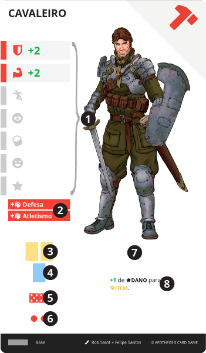

# Classe

> As classes são as especializações do personagem, representando o treinamento e a prática de habilidades específicas bem como seu ofício. Em um patamar narrativo, representam as escolhas profissionais ou de interesse de estudo daquela pessoa.

São os caminhos evolutivos escolhidos pelo personagem. Sua função é principalmente a de adicionar e aprimorar capacidades do personagem. Cada {{ class }} possui um caminho, que é uma linha de evolução, e um nível, que indica o quão avançado o personagem está naquela caminho.

Cada personagem pode possuir até 3 cartas de {{ class }} em sua {{ sheet }}, que são adquiridas conforme as regras.

||| :icon-file-moved:

||| :icon-arrow-down-right:
1. **Bônus de Atributo**: Valores adicionados aos [Atributos](/hero/attributes.md) do personagem

1. **Conhecimentos**: Adiciona {{ p'+1' }} de nível em cada {{ knowledge }} listado

1. **Espaços de Equipamento**: Bônus de espaços de {{ equip }}

1. **Espaços de Memento**: Bônus de espaços de {{ mem }}. Sendo que toda classe fornece pelo menos 1 espaço deste tipo

1. **Caminho**: Ícone do caminho da classe

1. **Nível da Carta**: de 1 a 3

1.  **Bônus**: Bônus passivo imediato aplicado ao Herói

1. **Efeito**: Texto do efeito desta carta
|||

| Nível da Classe                           | Nível 1 | Nível 2 | Nível 3 | {.compact}
| ---                                       | ---     | ---     | ---     |
| Somatório dos Bônus de Atributos          | 2       | 4       | 6       |
| Número de Conhecimentos                   | 2       | 2       | 3       |
| Soma dos Espaços de Equipamento e Memento | 2       | 3       | 4       |

---

## Caminho

Cada {{ class }} pertence a um caminho, que é uma linha de evolução. O caminho é representado por um ícone de uma peça de dominó, que é o mesmo para todas as cartas daquele caminho.

Dentre as 3 cartas de {{ class }} que um personagem pode possuir, ele pode ter apenas 1 carta de cada caminho.

Os 20 caminhos são:

| {.compact}
| ---              | ---                                                |
| {{ magician }}   | Magos, feiticeiros, bruxas                         |
| {{ priestess }}  | Estudiosos, pesquisadores, cientistas, alquimistas |
| {{ empress }}    | Herbalistas, druidas, xamãs, curandeiros           |
| {{ emperor }}    | Guerreiros, espadachins                            |
| {{ priest }}     | Religiosos, sacerdotes, clérigos                   |
| {{ lovers }}     | Arqueiros, pistoleiros, atiradores                 |
| {{ chariot }}    | Militares, mercenários, policias, soldados         |
| {{ force }}      | Bárbaros, selvagens, domadores, párias             |
| {{ hermit }}     | Eremitas, andarilhos, buscadores, filósofos        |
| {{ wheel }}      | Comerciantes, jogadores, trapaceiros, mercadores   |
| {{ justice }}    | Trabalhadores, profissionais, artesãos, ferreiros  |
| {{ hanged }}     | Caçadores, armadilheiros, rastreadores, batedores  |
| {{ death }}      | Ladrões, assassinos, espiões                       |
| {{ temperance }} | Artistas, bardos, músicos, dançarinos              |
| {{ devil }}      | Ocultistas, cultistas, necromantes                 |
| {{ tower }}      | Brigões, lutadores                                 |
| {{ star }}       | Aventureiros, exploradores, caçadores de tesouros  |
| {{ moon }}       | Mentalistas, ilusionistas, hipnólogos              |
| {{ sun }}        | Cavaleiros, heróis                                 |
| {{ judgment }}   | Vasculhadores, sobreviventes, desajustados         |
| {{ world }} | _Usado apenas por casos especiais, como summus._ |

---

## Adquirir

Para adicionar uma nova {{ class }}, o personagem precisa estar em um local de {{ tavern }} que permita acesso à carta, e então sacrificar seu turno.

Selecionar então, uma carta acessível, de um caminho que não possua e **enterre 5 cartas de recurso do mesmo nível** da carta selecionada.

A {{ class }} deve então ser enviada para um espaço disponível na sua {{ table }}. Se não houver espaços disponíveis, o personagem deve escolher e enterrar uma de suas cartas de {{ class }} na {{ sheet }} e adicionar a nova carta em seu lugar.

---

## Progredir

Se o personagem possuir em sua {{ sheet }}, uma {{ class }} do mesmo caminho de uma outra {{ class }} desejada e nível imediatamente inferior ou igual, para adquirir esta carta, siga as mesmas instruções em [Adquirir](/cards/class.md#adquirir), porém no momento de enterrar as cartas de custo, ao invés, enterre sua carta de {{ class }} de mesmo caminho e 3 cartas de recurso.

---
