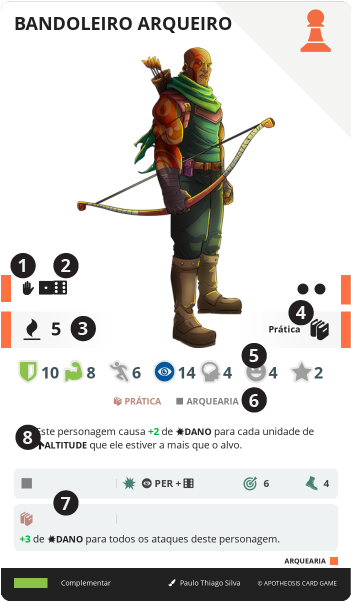

# COMPANHEIRO

> Representa um personagem que auxilia o herói em sua jornada. Pode ser desde um companheiro de batalha, um animal de estimação, um servo, um espírito, um ser etéreo ou qualquer outro ser vivo animado que possa ajudar o herói.

São personagens humanos, animais ou evocações. Diferente de um [Herói](/hero/), cujas características, conhecimentos, e habilidades são uma composição de várias cartas, os {{ companion }} são personagens definidos inteiramente por uma única carta que contém todas as informações necessárias para sua utilização, não possuindo {{ table }} e {{ inv }}, mas sim, sendo um NPC controlado pelo [Cartomante](/gameplay/game-master.md) ou parte da {{ table }} de um [Herói](/hero/).

||| :icon-file-moved:

||| :icon-arrow-down-right:
1. **Tipo**

1. **Caminho**

1. **Valor em Vontade**

1. **Nível e Conhecimentos**

1. **Atributos Base**: Bônus passivo imediato providos por esta carta

1. **Tipos de Anexos**: Texto do efeito desta carta

1. **Técnicas**: Texto do efeito deste movimento carta

1. **Efeito**: Texto do efeito desta carta
|||

---

## Tipo

A carta de {{ companion }} pode ser de 3 tipos diferentes, que são representados por ícones. O tipo da carta é importante para determinar como ela interage com outras cartas e mecânicas do jogo.

###  Humano

TODO

###  Criatura

TODO

###  Evocação

> Evocações são seres artificiais, criados a pártir da vontade de uma pessoa, combinada com uma magia específica de criação.
>
> Elas podem assumir qualquer forma, bem como possuir certas habilidades. Isso é realizado através de uma complexa e minuciosa transformação do éter em matéria viva, que é operado por um evocador, um personagem que possui o conhecimento e a habilidade necessária para criar e controlar essas criaturas. O processo de criação de uma evocação é extremamente complexo, e requer um profundo entendimento de como moldar e manipular a energia etérea para criar um corpo físico animado (criar corpo e alma).
>
> O resultado é uma energia viva que deve ser depositada em um material armazenador de éter, talhado de uma forma que se assemelhe a forma evocada da criatura, mantendo assim a energia em um formato transformável na forma final. Esse objetos são chamados de _totens_ e são feitos geralmente de madeira mágica, por ser mais abundante e fácil de trabalhar, mas podendo ser feito de qualquer outro material armazenador de éter.

> Quando uma nova evocação é criada, sua fórmula de criação é única, e pode ser compartilhada aprendida ou recriada por outros evocadores. Ao criador, cabe a tarefa de dar um nome para está nova espécie, e tradicionalmente a terminação “ero” é utilizada (_Perc**ero**, El**ero**, etc.._). Porém é também comum, o uso de nomes de criaturas vindas da mitologia ou fantasia que se assemelhem de certa forma àquela evocação.

> Para alguns, criar uma ser vivo é uma blasfêmia ou corrupção da natureza, e isso deve ser deixado apenas para o [Grande Criador](/world/lore.md#o-grande-criador), já outros, veem isso como uma forma de se tornarem cocriadores ou apenas ter servos úteis. Apesar disso, existem diferenças claras entre uma evocação e um ser natural, evocações são albinas, com pouca ou nenhuma coloração no corpo, são incapazes de se reproduzir. Além disso, as evocação não possuem um ciclo de vida natural, seus corpos tem pouca duração e se desfazem depois de alguns minutos, precisando ser recriados pelo evocador na proxima vez que forem evocadas.

TODO

Personagens desse tipo são desevocados ao final do combate.

#### Evocar
A carta de evocação permanece oculta até que seja evocada e não possui peça no tabuleiro. Para ser evocada, é necessário que o evocador (Herói) selecione uma casa adjacente vazia, e pague 2 de {{ mp }}.

Quando evocada, a carta é revelada e a peça do personagem evocação é adicionado na casa do tabuleiro selecionada.

Um COMPANHEIRO evocado, é colocado no final da fila de turnos na rodada em que é evocado, na rodada seguinte ele é posicionado na fila de turnos conforme sua PER.

#### Desevocar
O evocador pode a qualquer momento do seu turno, desevocar sua evocação, para isto ele anuncia a ação, oculta a carta da evocação e remove a peça dela do tabuleiro.

#### Morte da Evocação
Diferente de outros personagens, quando uma evocação morre, ela é desevocada (sua carta é ocultada) e sua peça é removida do tabuleiro, não deixando corpo, se ela possuir cartas anexadas, elas não devem ser descartadas. Quando desevocada dessa forma, ela não pode ser evocada novamente até o final da batalha.

---

## Caminho

Um {{ companion }} pode ou não pertencer a um caminho, que é uma linha de evolução. O caminho é representado por um ícone de uma peça de dominó, que é o mesmo para todas as cartas daquele caminho.

Os 20 caminhos são:

| Caminho | {{ human }}                                        | {{ creature }} e {{ summon }} | {.compact}
| ---     | ---                                                | ---                           |
|       | Magos, feiticeiros, bruxas                         | Fantásticos                   |
|       | Estudiosos, pesquisadores, cientistas, alquimistas | Humanoides                    |
|       | Herbalistas, druidas, xamãs, curandeiros           | Sintéticos                    |
|       | Guerreiros, espadachins                            | Quimeras                      |
|       | Religiosos, sacerdotes, clérigos                   | Marinhos                      |
|       | Arqueiros, pistoleiros, atiradores                 | Insetos                       |
|       | Militares, mercenários, policias, soldados         | Anfíbios                      |
|       | Bárbaros, selvagens, domadores, párias             | Feras                         |
|       | Eremitas, andarilhos, buscadores, filósofos        | Pássaros                      |
|       | Comerciantes, jogadores, trapaceiros, mercadores   | Mecanizados                   |
|       | Trabalhadores, profissionais, artesãos, ferreiros  | Primatas                      |
|       | Caçadores, armadilheiros, rastreadores, batedores  | Roedores                      |
|       | Ladrões, assassinos, espiões                       | Felinos                       |
|       | Artistas, bardos, músicos, dançarinos              | Peixes                        |
|       | Ocultistas, cultistas, necromantes                 | Dragões                       |
|       | Brigões, lutadores                                 | Répteis                       |
|       | Aventureiros, exploradores, caçadores de tesouros  | Crustáceos                    |
|       | Mentalistas, ilusionistas, hipnólogos              | Canídeos                      |
|       | Cavaleiros, heróis                                 | Equinos                       |
|       | Vasculhadores, sobreviventes, desajustados         | Lendários                     |
| {{ world }} | _Usado apenas por casos especiais, como summus._ | |

---

## Recrutar

Ao custo de 2 de {{ ap }}, esta carta pode ser enviada para um espaço disponível no {{ support }} do Herói.

- Se o personagem for {{ human }} ou {{ creature }}, ele deve ser colocado em uma [casa de acesso do tabuleiro](/board/index.md#casa-de-acesso). Se não houverem casas de acesso disponíveis, o personagem não pode ser recrutado.

- Se o personagem for uma {{ summon }}, coloque sua peça em uma casa adjacente ao Herói. Se não houver nenhuma casa adjacente disponível, este personagem não pode ser evocado.

---

## Abandonar

Ao custo de 2 de {{ ap }}, esta carta pode ser enviada do {{ support }} para o {{ inv }} do Herói.

- Se o personagem for {{ human }} ou {{ creature }}, é necessário que haja uma [casa de cesso do tabuleiro](/board/index.md#casa-de-acesso) disponível para que o personagem possa ser retirado do tabuleiro. Se não houver casas de acesso disponíveis, o personagem não pode ser abandonado.

- Se o personagem for uma {{ summon }}, remova sua peça do tabuleiro.

---

## Evoluir

Este é o processo de trocar uma carta de {{ companion }} em seu {{ support }} por outra de nível superior e mesmo caminho.

A qualquer momento do turno de um personagem {{ companion }} que esteja na {{ table }} de um Herói, mesmo que em combate ou quando ele não tem acesso ao {{ bestiary }}, ele pode sacrificar o seu turno e descartar 3 de {{ xp }}, para selecionar uma carta de {{ companion }} do {{ bestiary }} de nível imediatamente superior ao seu e de mesmo caminho, observando se o seu Herói possuí o {{ knowledge }} e nível necessário para ter aquela carta em sua {{ table }}, bem como outros requerimentos, se houverem.

Enterre então a carta de {{ companion }}, substituindo-a ela pela nova carta, que herda seus anexos e contadores.

---

## Anexos

Um {{ companion }} pode ter até 5 cartas anexadas a ele. Esse limite não pode ser excedido, nem mesmo por efeito de carta.

Durante o turno do Herói, ele pode anexar e/ou desanexar cartas do seu {{ inv }} a um de seus {{ companion }} em uma casa adjacente.

### Tipos de Anexo

Os tipos de anexos marcam características desejadas de cartas anexadas àquele {{ companion }}. As cartas anexadas não precisam ter esta característica, mas se tiverem, desbloqueiam técnicas em sua carta.

A característica listada abrange basicamente qualquer elemento de uma carta, como valores, propriedades, efeitos, etc..

---

## Personagem

Cartas de {{ companion }} são tratadas como personagens, e portanto, possuem uma peça no tabuleiro, podem ser atacados, mortos, realizar testes, etc.. tal qual um Herói.

### Pagamento de Custos

Os COMPANHEIROS podem ser requeridos a pagar certos custos pelo efeito de outras cartas ou mecânica de jogo, como descartar cartas e valores.

Observando que COMPANHEIROS não possuem MESA nem {{ inv }}, quando um texto especificar uma ação impossível para um COMPANHEIRO, como “descarte do seu {{ inv }}” ou “deite 2 de {{ mp }}”, o personagem não tem como cumprir aquela exigência, logo, ela deve ser ignorada.

Porém, quando o texto não apresenta uma restrição, por exemplo, “descarte uma carta” ou “descarte pontos de {{ fate }}”, o COMPANHEIRO pode/deve utilizar seus anexos nestes casos. Note que se o custo for obrigatório, o personagem precisa pagar, se for opcional o jogador pode optar.

A mesma consideração deve ser feita quando uma carta é obtida pelo COMPANHEIRO, se o texto disser algo como “enviado para o {{ inv }}”, o COMPANHEIRO não tem como realizar esta ação, mas se o texto apenas diz que a carta é “obtida”, ela pode/deve ser anexada ao companheiro, ainda respeitando o limite de anexos.

### Vida

O {{ hp }} da peça de um companheiro no tabuleiro é determinada pelo nível da carta.

| Nível  | Vida           | {.compact}
| ---    | ---            |
| 1      | {{ p " 5" }}  |
| 2      | {{ p " 10" }} |
| 3      | {{ p " 15" }} |

### Morte

Quando um {{ companion }} morrer, sua carta deve ser enterrada e todas as cartas anexadas devem ser descartadas para a sua respectiva pilha de descarte, exceto {{ item }}, que podem ser saqueados do seu corpo.

### Morte do Herói

Se o Herói morrer, o jogador deve continuar a batalha utilizando as peças de {{ companion }} do tipo {{ human }} e/ou {{ creature }} que lhe restam no tabuleiro, ignorando quaisquer efeitos dados pelo Herói. Se o Herói possuir {{ companion }} do tipo {{ summon }}, eles são desevocados imediatamente.

### Técnica

---
