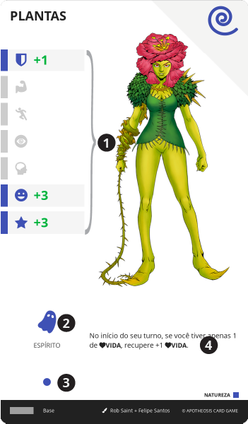

# Ente

> Entes são manifestações de energia pura, que habitam o universo e pelo acumulo, se tornam almas sem corpo ou consciência. Eles podem ser incorporados e adormecidos dentro do corpo de um personagem. Quando despertados pelo personagem, causam uma transformação do seu corpo, que concede poderes e habilidades especiais.
>
> A energia que quando aglomerada em um único ponto, se torna um ente, pode ser de qualquer natureza, como pensamentos, desejos, sentimentos, elementos, forças naturais, crenças, ideias, etc.

As cartas de {{ entity }} aplicam transformações no personagem, alterando seus atributos e habilidades, o que as tornam uma vantagem estratégica.

O personagem (receptáculo) pode incorporar, estas formas de energia e dominá-las. Cada corpo humano pode abrigar apenas um {{ entity }} por vez. Ele se mantém adormecido (carta oculta) e pode ser despertado (carta revelada) a qualquer momento, pelo receptáculo. Quando despertado, o corpo do receptáculo é transformado pelo {{ entity }}.

||| :icon-file-moved:

||| :icon-arrow-down-right:
1. **Bônus de Atributo**: Valores adicionados aos [Atributos](/hero/attributes.md) do personagem quando este {{ entity }} está desperto.

1. **Tipo**: Ícone e nome do tipo deste {{ entity }}, definido pelo nível da carta

1. **Nível da Carta**: Equivalente ao seu tipo. Pode ser {{ spirit }}➜1, {{ deity }}➜2 ou {{ god }}➜3

1. **Efeito**: Texto do efeito desta carta, disponível apenas quando o {{ entity }} está desperto
|||

| Nível                            | {{ spirit }} | {{ deity }} | {{ god }} | {.compact}
| ---                              | ---          | ---         | ---       |
| Somatório dos Bônus de Atributos | 7            | 14          | 21        |
| Valor Máximo em um Atributo      | 4            | 8           | 12        |
| Valor Mínimo em um Atributo      | -3           | -3          | -3        |

---

## Incorporar

Cada tipo de {{ entity }} possui um requerimento mínimo de nível para ser incorporado pelo personagem. Quanto mais poderoso o ente, mais preparo físico, mental e espiritual, o receptáculo precisa. Este requerimento deve sempre ser considerado, mesmo que o ente seja adicionado ao personagem por efeito de carta ou qualquer outra mecânica de jogo.

Para incorporar, é necessário que o espaço de {{ entity }} na {{ sheet }} esteja disponível e o personagem esteja em uma local de {{ wound }} que permita o acesso a carta desejada. Você deve selecionar uma carta, sacrificar o seu turno e enterrar 5 cartas de recurso do mesmo nível que o {{ entity }} selecionado. Envie a carta, oculta, para o espaço de {{ entity }} da sua {{ table }}.

TIPO         | NÍVEL | NÍVEL MÍNIMO REQUERIDO DO HERÓI
---          | ---   | ---
{{ spirit }} | 1     | 3
{{ deity }}  | 2     | 6
{{ god }}    | 3     | 9

> Quando um DEUS é incorporado, dá-se o nome de [apoteose](#ritual-de-apoteose).

---

## Despertar

Para despertar seu {{ entity }} (levantar usa carta), o personagem deve pagar 2 de {{ sp }} e/ou {{ mp }}.

Quando o ente estiver desperto, no início de cada um de seus turnos, o personagem pode pagar 2 de {{ sp }} e/ou {{ mp }}, caso contrário, o ente adormece.

Quando o {{ entity }} está desperto, sua carta deve ser revelada e o personagem recebe o bônus de atributo indicado na carta, bem como o seu efeito passa a ser considerado.

O {{ entity }} não pode ser adormecido no mesmo turno em que ele foi despertado, a não ser por efeito de carta.

---

## Adormecer

Quando o ente está adormecido, sua carta está oculta e seus bônus e efeitos não são mais considerados.

O jogador pode adormecer seu {{ entity }} a qualquer momento de seu turno. Para isso, basta ocultar a carta de {{ entity }}.

O {{ entity }} não pode ser despertado no mesmo turno em que ele foi adormecido, a não ser por efeito de carta.

---

## Liberar

Para remover a carta de {{ entity }} de sua {{ sheet }}, o personagem pode sacrificar seu turno e enterrar sua carta de {{ entity }}.

---

## Ritual de Apoteose

> É chamado de **Apoteose**, o processo de incorporar um ente de nível deus. Porém, os eterligadores costumam dividir a apoteose em dois tipos

### Pequena Apoteose

> Ou _Falsa Apoteose_, é realizado ao incorporar um deus de grau menor, de menor poder ou relevância. Geralmente deuses jovens, ligados a eventos específicos ou ações.

Em mecânicas de jogo, é quando o {{ entity }} é de **nível 3** ({{ god }}), e a raridade de sua carta é {{ epic }} ou inferior.

### Grande Apoteose

> Ou _Apoteose Verdadeira_, é realizado ao incorporar um deus de grau elevado, de grande poder e relevância. Geralmente deuses antigos, ligados aos primórdios da criação.

Em mecânicas de jogo, é quando o {{ entity }} é de **nível 3** ({{ god }}), e a raridade de sua carta é {{ legendary }}.

---
