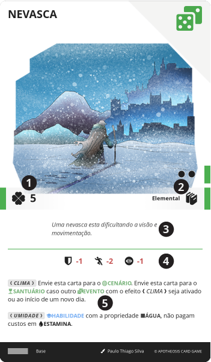

# EVENTO

> São cartas que representam acontecimentos e situações ocorrendo durante o jogo, como um encontro ou mudança súbita de clima. Em essência, são aquelas situações aleatórias que podem ocorrer no dia a dia de todos, sejam positivas ou negativas, e muitas vezes, imprevisíveis.

São cartas utilizadas para criar eventos aleatórios, que podem ser aplicados ao grupo. Elas são utilizadas para criar situações inesperadas, que podem alterar o rumo da aventura ou trazer desafios adicionais.

||| :icon-file-moved:

||| :icon-arrow-down-right:
1. **Valor**: Valor da carta em {{ fate }}

1. **Nível e Conhecimentos**: Requerimento para o Herói poder ter esta carta em a sua {{ table }}

1. **Descrição**: Texto narrativo ilustrativo

1. **Bônus**: Bônus passivo imediato aplicado a todos os personagens

1. **Efeito**: Texto do efeito desta carta
|||

---

## Ativar

Um evento é geralmente ativado quando o grupo está [viajando](/gameplay/travel.md) ou diretamente do {{ inv }} pelo Herói.

Para ser ativado pelo Herói, o evento deve estar em seu {{ inv }} e o Herói deve ter o {{ knowledge }} e nível da carta. A descrição e efeito do {{ event }} são então lidos em voz alta, que por final, é aplicado a todos os Heróis naquele momento e local.

Alguns {{ event }} podem requerer em seu efeito que devem ser enviados para o {{ scenario }}, geralmente determinando por quanto tempo, neste caso, os bônus e efeitos passivos da carta são aplicados continuamente enquanto ela permanecer no {{ scenario }}, bem como qualquer efeito listado que determine como pode ser utilizado.

---
