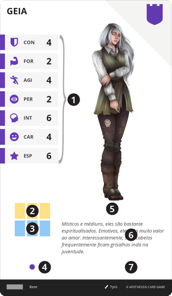

# Casa

> Representa um conjunto de várias famílias, diferentes em nome, porém ligadas por uma linhagem ancestral comum, não sendo necessariamente parentes, mas sim descendentes de um mesmo povo ou grupo. Os membros comumente apresentam comportamentos estereotípicos da casa, que são reconhecidas por sua, história, cultura e tradições.

É a pedra fundamental da construção de todo Herói, a sua base. Ao ser criado, o Herói já começa com uma carta de {{ house }} em sua {{ sheet }}, e é a partir dela que se constrói o restante do personagem.

O jogador recebe uma carta de {{ house }} com base em disponibilidade e regras definidas pela campanha, como por exemplo, por escolha, sorteio, etc..

||| :icon-file-moved:

||| :icon-arrow-down-right:
1. **Atributos Base**: Valores iniciais dos [Atributos](/hero/attributes.md) do personagem.

1. **Espaços iniciais de Equipamento**: Toda casa confere 3 espaços de {{ equip }}

1. **Espaços iniciais de Memento**: Toda casa confere 3 espaços de {{ mem }}

1. **Nível da Carta**: Toda casa é de nível 1

1. **Bônus**: Bônus passivo imediato aplicado ao Herói

1. **Descrição**: Texto narrativo da casa, descrevendo sua história, cultura e tradições.

1. **Efeito**: Habilidade hereditária natural da casa, se houver.
|||

| Características                  | Valor | {.compact}
| ---                              | ---   |
| Somatório dos Atributos Base     | 28    |
| Valor Máximo em um Atributo Base | 6     |
| Valor Mínimo em um Atributo Base | 2     |

---
