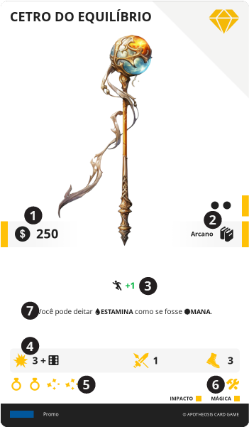

# ITEM

> Representa objetos úteis, como ferramentas, armas, e alimentos, ou mesmo coisas como veículos e armaduras.

São cartas que podem ser usadas para complementar um personagem, servindo como ferramentas que auxiliam em certas atividades bem como fornecem bônus. Eles complementam um personagem, na forma de armaduras, armas, consumíveis, entre outros.

||| :icon-file-moved:

||| :icon-arrow-down-right:
1. **Valor em Preço**

1. **Nível e Conhecimentos**: Requerimento para o Herói poder ter esta carta em a sua {{ table }}

1. **Bônus**: Bônus passivos imediatos

1. **Barra de Ativação**

1. **Materiais**: Ícones dos materiais de fabricação

1. **Especificadores**: Ícones dos especificadores

1. **Efeito**: Texto do efeito da carta
|||

---

## Equipar

Ao custo de 2 de {{ ap }}, esta carta pode ser enviada para um espaço disponível no {{ equip }} do Herói.

---

## Desequipar

Ao custo de 2 de {{ ap }}, esta carta pode ser enviada do {{ equip }} para o {{ inv }} do Herói.

---

## Barra de Ativação

Quando um {{ item }} em seu {{ equip }} possuir uma barra de ativação, em adicional as regras de [ativação de carta](/cards/index.md#efeito), o Herói deve antes deve seguir os seguintes passos:

1. Verificar se a ativação é possível, vendo se o Herói possui os requisitos de custo e condições adicionais que possam existir no texto da carta. Bem como se o texto é possível de ser aplicado naquele momento da partida.
1. Pagar o custo de {{ ap }} descritos.
1. Se a barra de ativação possuir um {{ range }}, selecionar um alvo válido
1. Se a barra de ativação possuir um {{ dmg }}, aplicá-lo ao alvo selecionado
1. Observar o efeito da carta, e aplicar o que for necessário

---

## Item sem Preço

{{ item }} São as únicas cartas de Recurso que podem não ter um valor (preço).

Se um {{ item }} não possuir {{ price }}, ele não pode ser obtido pelos meios padrões de trocas de cartas com a pilha de descarte, e deve ser considerado como tendo valor zero em qualquer troca. Estes ainda podem ser obtidos de outras formas, como por exemplo, através de ações de personagens ou efeitos de cartas.

---

## Especificadores

Alguns {{ item }} podem possuir especificadores, que são ícones que definem um tipo de objeto. O Herói pode ter apenas uma carta de cada especificador equipado por vez.

Tipos de Especificadores:

*  Veste
*  Cabeça
*  Pés
*  Acessório
*  Utilitário

---

## Fabricar

Uma forma alternativa de se obter um {{ item }}, é fabricando-o. Para isso, o personagem deve sacrificar seu turno, selecionar um {{ item }} na pilha de descarte do {{ market }}, cujo nível mínimo do {{ knowledge }} ele possua, e enterrar cartas de {{ item }} de sua {{ table }} e/ou {{ inv }}, que juntas contenham pelo menos os mesmos ícones de materiais, na mesma quantidade, presentes na carta selecionada.

Tipos de Materiais de Fabricação:

*  Forja
*  Alquimia
*  Herbalismo
*  Costura
*  Culinária
*  Bebida
*  Joalheria
*  Encantamento
*  Artesanato
*  Armeiro
*  Mecânico
*  Oricalco
*  Âmbar

Em adicional, não é possível fabricar um {{ item }} quando em batalha, e não é necessário estar em um local com acesso à pilha de descarte.

---
