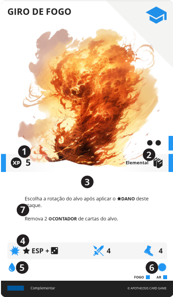

# HABILIDADE

Representam novas capacidades físicas, mentais e espirituais adquiridas por um personagem, conforme ganha experiência de vida, que concedem efeitos e modificadores.

||| :icon-file-moved:

||| :icon-arrow-down-right:
1. **Valor em XP**

1. **Nível e Conhecimentos**

1. **Bônus**: Bônus passivo imediato providos por esta carta

1. **Efeito**: Texto do efeito desta carta

1. **Dano**

1. **Alcance**

1. {{ ap }}

1. {{ sp }}

1. {{ mp }}
|||

---

## Aprender

Ao custo de 2 de {{ ap }}, esta carta pode ser enviada para um espaço disponível no {{ mem }} do Herói.

---

## Esquecer

Ao custo de 2 de {{ ap }}, esta carta pode ser enviada do {{ mem }} para o {{ inv }} do Herói.

---

## ATIVAR
Se uma HABILIDADE em seu {{ mem }}, possuir "Custo de {{ ap }}", você deve pagar este custo para executar seu efeito. Em adicional, deve deitar cartas do seu {{ mem }}, cuja soma de suas {{ sp }} e a soma de suas {{ mp }}, sejam iguais ou superiores à da carta sendo executada.

LEVENTAR O TROCO: Caso seja deitada uma quantidade superior à necessária, você pode levantar cartas do {{ mem }}, cuja soma de suas {{ sp }} e a soma de suas {{ mp }}, sejam iguais ou inferiores ao valor extra pago.

!!!
Note que a própria carta possui a quantidade de {{ sp }} e {{ mp }} que ela requer. Assim, deitar a própria carta já é o suficiente para ativá-la.

Uma HABILIDADE deitada não está de forma alguma "desativada", e pode ser usada normalmente, desde que pagos seus custos. A carta estar deitada, simboliza apenas que os recursos de {{ sp }} e {{ mp }} que ela disponibiliza, já foram utilizados.
!!!

Ao executar uma HABILIDADE, o jogador deve verificar se o efeito deve ser usado neste momento e se a HABILIDADE possui um ALCANCE. O que significa que ele deve selecionar um alvo no tabuleiro, que esteja dentro desse limite. Se a HABILIDADE também possuir um {{ dmg }}, o alvo recebe este {{ dmg }}.

---

## LIGNUM
É um conjunto de cartas de HABILIDADE interligadas. Você pode identificá-las pela presença do nome do LIGNUM antes do nome da carta, separados por um | (Barra Vertical).

Um espaço do {{ mem }} pode conter até 3 cartas de um mesmo LIGNUM. É possível ter cartas de LIGNUM diferentes no {{ mem }}, ocupando espaços diferentes, porém a soma de suas cartas de LIGNUM não pode ser superior a 9.

!!!
É possível aprender mais de 3 cartas de um LIGNUM no {{ mem }}, ocupando mais de um espaço. Por exemplo, para ter 5 cartas de um LIGNUM no {{ mem }}, pode-se colocar 3 cartas no primeiro espaço e 2 cartas no segundo espaço.
!!!

### Essência

(TODO) Cada carta de LIGNUM possui uma essência, que é representada por uma cor. A essência de uma carta de LIGNUM é a mesma para todas as cartas do mesmo LIGNUM.

Essência é um recurso que pode também ser tratado como {{ sp }} e/ou {{ mp }}.

Quando você puder _“levantar troco”_, o troco deve ser da mesma cor ou levante {{ mp }} e/ou {{ sp }}.

{.list-icon}
* :icon-chevron-right: {{ yellow }} - Representa a essência de Lignums de natureza física, como força, resistência, objetos materiais, etc.

* :icon-chevron-right: {{ red }} - Representa a essência de Lignums de natureza expansionista, como poder, controle, dominação, atitude, etc.

* :icon-chevron-right: {{ blue }} - Representa a essência de Lignums de natureza intelectual, como conhecimento, sabedoria, estratégia, etc.

* :icon-chevron-right: {{ white }} - Representa a essência de Lignums de natureza espiritual, como fé, esperança, amor, magia branca, etc.

* :icon-chevron-right: {{ black }} - Representa a essência de Lignums de natureza destrutiva, como morte, dor, sofrimento, magia negra, etc.

---
