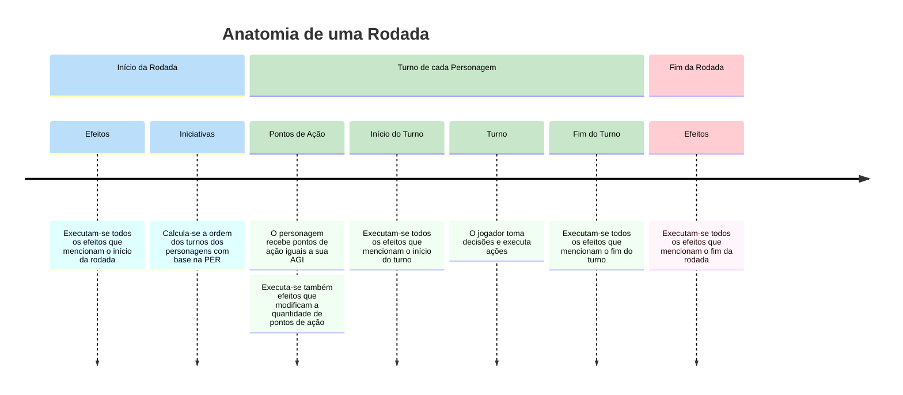

# Rodadas e Turnos
Este é um jogo de turnos, isso quer dizer que cada jogador realiza suas jogadas e então passa a vez para o próximo jogador.

---

## Rodada
Uma rodada é composta pela sequência de turnos de todos os personagens. Quando todos os personagens terminarem seus turnos em ordem, tem início uma nova rodada.

Uma rodada tem início e fim.

### Início da Rodada

Nesta fase é determinado a ordem dos turnos dos personagens nesta rodada.
A ordem em que cada personagem joga é definida pela PER de cada um de forma decrescente. Quando personagens tiverem a mesma PER, eles desempatam entre si rolando 1d6. Caso empatem novamente, rola-se novamente entre os empatados até um desempate.

### Fim da Rodada
Esta fase acontece quando o último personagem na ordem de turnos encerrar seu turno. Aplica-se quaisquer efeitos que mencionem esta fase e então procede-se para o início da próxima rodada.

---

## Turno
O turno de um personagem é composto por 3 fases em sequência.

### Início do Turno
Compõe o momento em que o turno de um personagem começa, antes que ele possa agir. Neste momento são aplicados todos os efeitos e mecânicas que especificam “No início do seu turno”.

### Durante o Turno
Nesta fase o personagem recebe uma quantidade de Pontos de {{ ap }} equivalentes à sua AGI.
O jogador pode então tomar decisões e executar as diferentes ações e cartas disponíveis, observando os custos das mesmas e os recursos disponíveis.

### Fim do Turno
Compõe o momento em que o jogador declara ter encerrado o seu turno. Neste momento são aplicados todos os efeitos que especificam “Ao final do seu turno” e após isso procede-se para o Início do Turno do próximo personagem na ordem de turnos desta rodada.

É nesta fase também que, todos os pontos de {{ ap }} que não foram gastos neste turno são perdidos.

---

## Simultaneidade de Efeitos
Note que todos os efeitos que devem ser aplicados durante uma determinada fase são aplicados simultaneamente, ou seja, todos acontecem ao mesmo tempo, não tendo uma sucessão ou ordem a ser seguida.

!!!
Por exemplo: Se um efeito diz que “No início do seu turno você deve deitar 2 de {{ mp }}” e outro efeito diz que “No início do seu turno você recupera 2 de {{ mp }}”, ambos os efeitos correm simultaneamente, portando você não pode usar a {{ mp }} recuperada no segundo efeito para pagar o primeiro.

Neste caso recomenda-se como boa prática, aplicar todos os efeitos dedutivos primeiro e então aplicar os efeitos de recuperação, isso evita que recursos sejam utilizados antes de estarem disponíveis.
!!!

---

## Passagem do Tempo

A passagem do tempo é uma mecânica que pode ser relevante para a estória e para a jogabilidade, e é dividida em duas partes: Período do Dia e Calendário.

### Período do Dia

Quando não estiverem em batalha a passagem do tempo é contada em períodos do dia. Cada períodos do dia representa 4 horas, e o dia é dividido em 6 períodos, sendo:

* Dia _(Claro)_
    * [!badge variant="warning"   text="04:00 às 08:00"] Amanhecer
    * [!badge variant="primary"   text="08:00 às 12:00"] Manhã
    * [!badge variant="primary"   text="12:00 às 16:00"] Tarde
* Noite _(Escuro)_
    * [!badge variant="secondary" text="16:00 às 20:00"] Anoitecer
    * [!badge variant="dark"      text="20:00 às 00:00"] Noite
    * [!badge variant="dark"      text="00:00 às 04:00"] Madrugada

Quando não estiverem em batalha, o período do dia avança a cada 4 rodada, e o dia avança a cada 6 períodos do dia.

Quando em batalha, o período do dia não avança, e o dia permanece o mesmo durante toda a batalha.

Note que, se um personagem iniciar uma batalha, outro personagens que não estiverem em batalha, devem esperar que esta batalha acabe para poderem jogar seus turnos.

### Calendário

O ano no jogo é simbolicamente composto por 12 semanas que são tratadas como meses, e sendo cada semana composta por 7 dias, o ano tem 84 dias.

Algumas campanhas podem se referir a dias da semana ou datas específicas, e a passagem do tempo pode ser relevante para a história.

A seguir está um calendário padrão que pode ser utilizado como referência para a passagem do tempo, e que pode ser adaptado conforme necessário para a campanha.

#### Datas

| {.compact}
--- | --- | --- | ---
:icon-triangle-right: <u>**1 de janeiro**</u> | Dia 1  | ❄️ Solstício de Inverno   | _Noite mais longa do ano_
                      6 de fevereiro          | Dia 17 | 🎭 Carnaval               |
:icon-triangle-right: <u>**1 de abril**</u>   | Dia 21 | 🌱 Equinócio de Primavera | _Dia e noite iguais_
:icon-triangle-right: <u>**1 de julho**</u>   | Dia 42 | ☀️ Solstício de Verão     | _Dia mais longo do ano_
                      2 de agosto             | Dia 44 | 🌾 Festival das Colheitas | _Tipo um Dia de Ação de Graças_
:icon-triangle-right: <u>**1 de outubro**</u> | Dia 63 | 🍂 Equinócio de Outono    | _Dia e noite iguais_
                      7 de outubro            | Dia 70 | 🎃 Halloween              | _O dia em que o véu está mais fino_
                      4 de dezembro           | Dia 78 | 🎄 Natal                  |
                      7 de dezembro           | Dia 84 | 🎆 Véspera do Ano-Novo    |

!!!
O calendário lunar e/ou astronômico pode também ser definido, se relevante.
!!!

---
