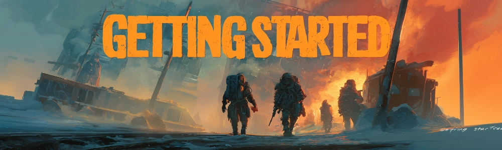
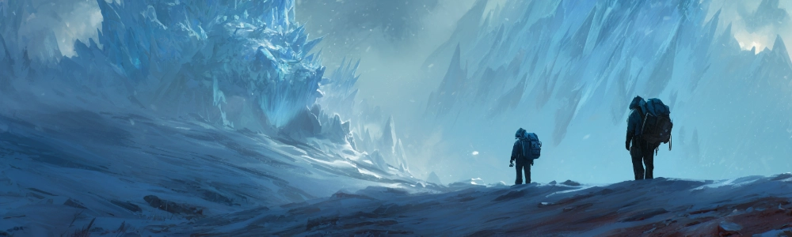
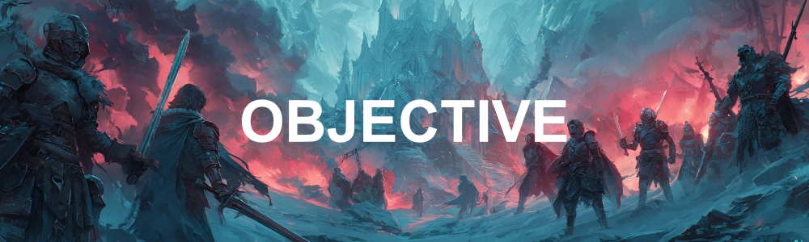
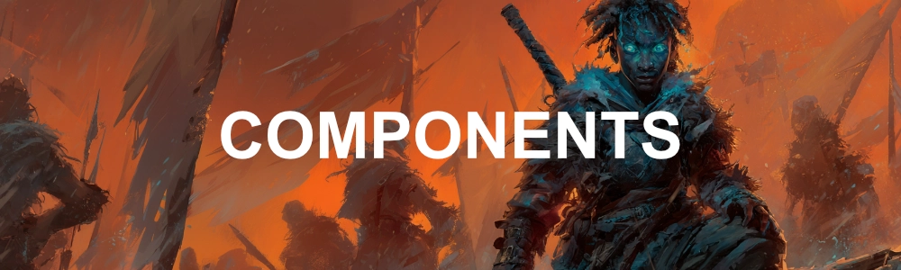
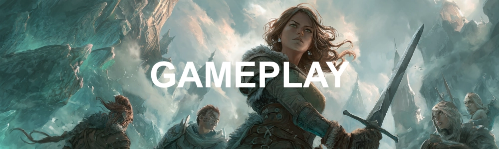
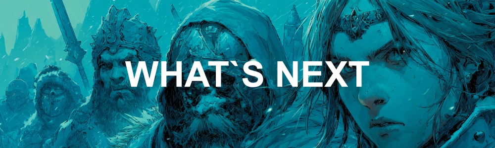

# Começando a Jogar

%% ============================================================================================= %%
>>> O QUE É APOTHEOSIS CARD GAME
%% ============================================================================================= %%

  {.rounded-lg .logo}

  %% ----------------------------------------------------------------------- %%
  ==- Gênero e estilo
  %% ----------------------------------------------------------------------- %%

  Este é um jogo de tabuleiro e cartas híbrido que combina elementos de:
  - [Role Playing Game (RPG)](https://en.wikipedia.org/wiki/Role-playing_game)
  - [Construção de baralho (Deck Building)](https://en.wikipedia.org/wiki/Deck-building_game)
  - [Batalha em tabuleiro quadriculado (TRPG)](https://en.wikipedia.org/wiki/Tactical_role-playing_game)

  A ambientação do jogo se passa em um universo fictício que combina elementos estéticos de ficção científica, pós-apocalíptico, horror e fantasia.

  [!embed text="Vídeo de resumo rápido"](https://www.youtube.com/watch?v=xbdaQHcJt1I)

  %% ----------------------------------------------------------------------- %%
  ==- Como é o jogo
  %% ----------------------------------------------------------------------- %%

  Os jogadores escolhem uma campanha, formato e/ou modo de jogo, e cada um constrói um conjunto de cartas que representa o seu personagem, chamado de Herói. Durante a partida, os jogadores podem adquirir novas cartas para fortalecer seus Heróis.

  O objetivo é cumprir missões, enfrentar desafios, ou derrotar outros jogadores, utilizando suas cartas, conforme estabelecido pelo modo de jogo escolhido.

  Quando um confronto ocorre, os jogadores utilizam um tabuleiro quadriculado para posicionar seus Heróis e outros personagens, e rolam dados para resolver ações, ataques e efeitos de cartas na intenção de derrotar seus oponentes ou cumprir os objetivos da partida.

  %% ----------------------------------------------------------------------- %%
  ==- O que você precisa para jogar
  %% ----------------------------------------------------------------------- %%

  ##### Jogadores

  A quantidade de jogadores é definida pelo modo de jogo escolhido ou pela campanha.

  - De 1 a 9 jogares
  - Algumas campanhas podem requerer um **jogador extra** que será o [mestre de jogo](/gameplay/game-master.md), responsável por narrar a história, controlar os inimigos e desafios, e arbitrar as regras

  ##### Cartas

  Campanhas e modos de jogo estabelecem regras específicas sobre quais cartas são utilizadas, mas geralmente os jogadores precisam de um conjunto de cartas para jogar, que pode ser um conjunto base ou um baralho customizado, dependendo do formato escolhido.

  - Conjuntos base são caixas contendo uma seleção específica de cartas que permite jogar a maioria dos modos de jogo
  - Em alguns modos cada jogador precisa trazer seu baralho de cartas customizado

  ##### Tabuleiro

  Um tabuleiro quadriculado onde as batalhas entre os personagens possam ocorrer.

  - De 2x1 até qualquer tamanho máximo, dependendo do modo de jogo escolhido
  - Uma forma de representar os personagens e elementos no tabuleiro (peças, pinos, peões, figuras, moedas, tokens, etc.)
  - Dados de 6 lados suficientes para todos os jogadores

  ##### Material de Consulta

  Alguns livros, cartilhas e textos auxiliares podem ser úteis, mas não necessariamente obrigatórios.

  - Livro de regras, se necessário
  - Livro contendo a campanha, se houver
  - E quaisquer materiais adicionais ou auxiliares definidos pela campanha, se houverem

  ---

  !!!warning
  Apesar de todas estas regras serem flexíveis à configuração desejada pelos jogadores, quando em partidas que incluem PvP (Jogadores batalhando entre si), observe que as cartas foram projetadas e balanceadas pensando em batalhas de até **3x3** Heróis em um tabuleiro de até **11x11** casas.
  !!!

  ===

%% ============================================================================================= %%
>>> CONTEXTO
%% ============================================================================================= %%

  {.rounded-lg .logo}

  %% ----------------------------------------------------------------------- %%
  ==- O Mundo do Jogo
  %% ----------------------------------------------------------------------- %%

  As partidas de APOTHEOSIS CARD GAME se passam em um universo fictício, com história, narrativa e ambientação próprias, tendo primariamente um estilo de ficção científica pós-apocalíptica combinada com elementos de fantasia, como magia, poderes especiais e criaturas fantásticas.

  Nesta linha do tempo alternativa, no início do século XXI um evento apocalíptico de proporções globais, conhecido como **O Congelamento**, causou a manifestação de fenômenos sobrenaturais que trouxeram energias etéreas a muito tempo contidas no interior do planeta de volta para a superfície em abundância, dando origem a um mundo onde a magia e as ruínas do passado coexistem, e onde humanos, criaturas fantásticas e entidades sobrenaturais lutam por poder, sobrevivência e controle.

  Como jogador, você assume o papel de um Herói, um indivíduo que possui a capacidade extras tanto mentais quantos espirituais em relação aos outros habitantes do mundo. Sendo imersos em um cenário de caos e conflito, os Heróis buscam cumprir seus objetivos, sejam eles pessoais ou coletivos, enfrentando desafios, inimigos e outros Heróis em uma jornada épica de descobertas, batalhas e conquistas.

  !!!
  Para saber mais sobre o universo do jogo, consulte a seção de [Mundo do Jogo](/lore).
  !!!

  %% ----------------------------------------------------------------------- %%
  ==- Sistema de Jogo
  %% ----------------------------------------------------------------------- %%

  O sistema de jogo é o conjunto de regras e mecânicas que regem como as partidas de APOTHEOSIS CARD GAME são jogadas. Ele define como os jogadores interagem com o jogo, como as ações são resolvidas, e como os objetivos são alcançados.

  !!!
  Observe que, apesar do sistema vir acompanhado de um universo e narrativa específicos, ele é modular e pode ser adaptado para diferentes contextos, histórias e ambientações, de acordo com a preferência dos jogadores. Sendo possível jogar o sistema de jogo sem qualquer contexto ou narrativa, ou com um contexto e narrativa completamente diferente do universo oficial do jogo.
  !!!

  ===

%% ============================================================================================= %%
>>> OBJETIVO DO JOGO
%% ============================================================================================= %%

  {.rounded-lg .logo}

  %% ----------------------------------------------------------------------- %%
  ==- Condição de Vitória
  %% ----------------------------------------------------------------------- %%

  Em APOTHEOSIS CARD GAME o objetivo consiste em construir um baralho eficiente e estratégico que representa o seu personagem no universo do jogo, combinando e explorando as melhores sinergias entre cartas ao longo da partida, e utilizar este baralho em constante evolução, para cumprir objetivos, enfrentar desafios, ou derrotar outros jogadores.

  Sendo este um jogo modular, ele pode ser jogado de diversas formas, com diferentes propostas e mecânicas, de acordo com a preferência dos jogadores. Permitindo objetivos que podem ser cumprindo de forma cooperativa ou competitiva, bem como modos exclusivamente de batalha.

  Em adicional, objetivos e desafios específicos podem ser definidos para cada partida, de acordo com o formato escolhido, bem como propostos por uma [campanha](/gameplay/campaigns.md), [formatos](#formato) ou metre de jogo.

  ##### Cooperativo

  Os jogadores unem forças em uma campanha épica, enfrentando desafios e inimigos controlados pelo jogo ou por um narrador. A cada sessão, adquirem novas cartas para fortalecer seus personagens, com o objetivo final de derrotar ameaças crescentes e completar a campanha com sucesso.

  ##### Competitivo

  Jogado da mesma forma que o modo cooperativo, porém os jogadores jogam individualmente ou divididos em dois ou mais times, competindo em uma corrida para cumprir primeiro o objetivo definido.

  ##### Arena

  Dois ou mais jogadores ou equipes se enfrentam em um confronto tático, utilizando seus baralhos personalizados desenvolvidos por cada jogador antes da partida. O objetivo é derrotar o time adversário em batalhas estratégicas no tabuleiro. A equipe que eliminar todos os oponentes ou atingir o objetivo específico da partida será a vencedora.

  %% ----------------------------------------------------------------------- %%
  ==- Formatos, Campanhas e Modos de Jogo
  %% ----------------------------------------------------------------------- %%

  ##### Formatos

  Os formatos de jogo são conjuntos personalizados de regras que adicionam ou modificam as regras padrões de jogo. São utilizados para criar diferentes formas de jogar e permitir a customização por parte dos jogadores

  Consulte a seção de [Formatos](/gameplay/formats.md) para conhecer os formatos oficiais do jogo, e sinta-se livre para criar seus próprios formatos personalizados, adaptando as regras e mecânicas do jogo para atender às suas preferências e necessidades.

  ##### Campanhas

  As campanhas são histórias pré-definidas que guiam os jogadores através de uma série de missões e desafios, utilizando as cartas e mecânicas do jogo para criar uma experiência narrativa imersiva.

  ##### Modos de Jogo

  Já os modos de jogo são variações nas regras e objetivos que permitem diferentes formas de jogar, seja cooperativamente, competitivamente ou em arena.

  %% ----------------------------------------------------------------------- %%
  ==- Preparando a Partida
  %% ----------------------------------------------------------------------- %%

  ##### Configuração da Partida

  Uma vez escolhido o formato, campanha e/ou modo de jogo, siga as regras e passos definidos por estes para preparar a partida. Estes passos podem variar dependendo da escolha e configuração, mas geralmente incluem:

  ##### Cartas

  Separe as cartas iniciais listadas, faça 1 baralho para cada naipe e embaralhe cada um. Posicione estes baralhos na área do jogo de forma que os jogadores possam ter acesso. Reserve também uma zona para a pilha de descarte.

  !!!
  Na maioria dos modos de Arena, os jogadores trazem os seus baralhos customizados prontos, e apenas embaralham suas cartas de recurso antes de começar a partida
  !!!

  ##### Heróis

  Cada jogador precisa de um Herói. A configuração da partida costuma definir regras próprias de como os Heróis devem ser criados. Algumas formas comuns são:

  - Cada jogador escolhe uma carta de {{ house }} de um conjunto predefinido
  - Uma quantidade de cartas do conjunto total de cartas de {{ house }} é distribuído aleatoriamente para os jogadores e cada um escolhe uma carta, devolvendo as demais para o baralho

  > Uma carta de {{ house }} é tudo que você precisa para definir um Herói.

  !!!
  Os jogadores podem também definir um nome, idade, sexo e aparência para seu Herói, se desejarem, sendo estas características opcionais para a maioria dos modos de jogo.e irrelevantes para as regras de jogo, sendo de caráter narrativo.
  !!!

  ===

%% ============================================================================================= %%
>>> COMPONENTES DO JOGO
%% ============================================================================================= %%

  {.rounded-lg .logo}

  %% ----------------------------------------------------------------------- %%
  === As Cartas
  %% ----------------------------------------------------------------------- %%

  Divida as cartas em categorias lógicas:
  Cartas Principais/Líderes: O pilar do deck ou ficha de personagem.
  Cartas de Unidade/Batalha: Quem luta por você (Personagens/Monstros).
  Cartas de Efeito/Magia: Eventos de uso único (Opções/Magias/Armadilhas).

  Leitura da Carta: Mostre onde olhar o Custo de jogo, o Poder de Ataque (ATK/DP) e os Efeitos.

  %% ----------------------------------------------------------------------- %%
  === Os Personagens
  %% ----------------------------------------------------------------------- %%

  %% ----------------------------------------------------------------------- %%
  === Mesa
  %% ----------------------------------------------------------------------- %%

  %% ----------------------------------------------------------------------- %%
  === Tabuleiro
  %% ----------------------------------------------------------------------- %%

  Peças

  Mostre onde as coisas ficam. Apresente a Zona do Deck, Zona de Descarte/Cemitério, Zona de Batalha/Campo, e a área de Recursos (Energia/Mana).

  ===

%% ============================================================================================= %%
>>> JOGANDO
%% ============================================================================================= %%

  {.rounded-lg .logo}

  %% ----------------------------------------------------------------------- %%
  === O Loop Narrativo (O lado RPG)
  %% ----------------------------------------------------------------------- %%

  Game Loop

  Explique como a interação flui: 1) O Mestre descreve o ambiente; 2) O Jogador diz o que quer fazer; 3) O Mestre narra o resultado através das cartas/dados.

  Fase Inicial/Preparação: Desvirar cartas usadas (do modo "descanso/rest" para "ativo").
  Fase de Compra: Comprar carta do deck.
  Fase de Recursos: Ganhar ou baixar a energia/mana necessária para jogar cartas.
  Fase Principal: Jogar personagens, equipar itens, usar magias.

  %% ----------------------------------------------------------------------- %%
  === Os Personagens
  %% ----------------------------------------------------------------------- %%

  %% ----------------------------------------------------------------------- %%
  === O Tabuleiro (Áreas de Jogo)
  %% ----------------------------------------------------------------------- %%

  Mostre onde as coisas ficam. Apresente a Zona do Deck, Zona de Descarte/Cemitério, Zona de Batalha/Campo, e a área de Recursos (Energia/Mana).

  ===

%% ============================================================================================= %%
>>> BATALHA
%% ============================================================================================= %%

  {.rounded-lg .logo}

  %% ----------------------------------------------------------------------- %%
  === Batalha e Combate Simulado (Mão na Massa)
  %% ----------------------------------------------------------------------- %%

  A melhor técnica didática é distribuir "Decks Iniciais" (Starter Decks) simplificados e jogar alguns turnos abertos, guiando as decisões do novato.
  Passo a Passo do Combate: Ao invés de ler regras, simule um ataque:
  Declaração: Escolha o atacante (virando a carta) e o alvo.
  Passo de Reação/Defesa: Ensine que o oponente pode responder. Mostre como usar cartas de "Contra-ataque", bloqueadores ou somar "Poder de Combo" da mão para se defender.
  Cálculo de Dano: Compare o Poder. Se o atacante for maior ou igual, ele vence. Mostre como o dano afeta o Líder/Personagem.

  ===

%% ============================================================================================= %%
>>> O QUE VEM A SEGUIR
%% ============================================================================================= %%

  {.rounded-lg .logo}

  e AGORA?

  Glossário, regras, avançadas, consultar tópicos, etc.

>>>

---
