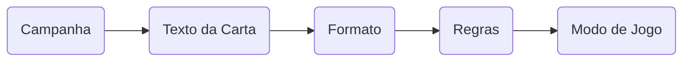

# Diretrizes

As diretrizes são regras gerais aplicáveis a todas as situações do jogo. Elas devem ser seguidas sempre que possível, a não ser quando uma regra mais específica ou um efeito de carta disser o contrário.

---

## Siga o Texto

A combinação de texto e mecânica diz tudo o que você precisa saber; não é preciso adicionar regras. Esteja atento ao texto: se ele explicita que você _“deve fazer algo”_, aquilo é obrigatório. Por outro lado, se ele diz que você _“pode fazer algo”_, ele está lhe dando uma opção, e assim por diante.

### Precedência de Regras

---

## Bônus

Quando um número é apresentado na forma **+X** ou **-X**, isso indica que se trata de um bônus. Por exemplo:

{{ dmg }} = {{ str }} + 3 + {{ d1d6 }}
:   {{ str }} é o valor base que recebe os bônus.

    Tanto o valor 3 quanto o valor {{ d1d6 }}(1D6) são bônus adicionados a este {{ dmg }}.

Efeito: {{ p'+2' }} em testes de {{ faith }}
:   O valor {{ p'+2' }} é um bônus adicionado ao valor que obtiver em um teste cujo conhecimento seja {{ faith }}.

---

## Valor Mínimo

Toda operação matemática cujo resultado final seja um valor **igual ou inferior a zero** deve ser considerada como tendo resultado igual a **1**.

Portanto, não é possível que um personagem tenha um Atributo com valor zero, ou cause {{ dmg }} negativo, por exemplo.

---

## Divisão e Arredondamento

Toda divisão que tiver como resultado um valor fracionado deve ser arredondada para baixo, de forma a utilizar sempre números inteiros.

---

## Individualidade

Ninguém pode jogar o turno de um jogador por ele; cada um deve agir por conta própria. Se um jogador quer a opinião de outro antes de agir, seus personagens precisam conversar, e não os jogadores. Personifiquem os personagens e interpretem-nos.

---

## Abstração

Isso é um jogo, não um simulador. Quando as regras entrarem em conflito com a lógica, é preferível seguir as regras.

Durante o jogo, inúmeras abstrações narrativas são feitas: o dia a dia do personagem e o que acontece entre as cenas relevantes não é jogado. Situações cotidianas como refeições, descanso, manutenção de equipamentos, idas ao banheiro e cuidados com companheiros acontecem naturalmente nos bastidores.

Considere que:

- Durante viagens, o personagem fez paradas, conheceu pessoas e interagiu com o ambiente.
- Antes de um teste, o personagem se preparou, refletiu e aprendeu além do resultado final.
- A mudança de classe representa um crescimento gradual, fruto de inúmeras experiências vividas.
- Itens são reparados e mantidos em boas condições pelo personagem.
- Companheiros têm suas próprias vidas, experiências e necessidades.

Efeitos de cartas ativadas podem não parecer fazer sentido do ponto de vista narrativo, mas isso não é um problema. Use a criatividade para imaginar como o efeito da carta se encaixa na narrativa, mesmo que seja algo abstrato ou requeira uma interpretação mais livre.

Cada mecânica é uma representação simbólica e jogável de uma situação. Não se prenda a possíveis incoerências; o importante é que o jogo seja dinâmico e divertido.

---

## Regra de Ouro

Os jogadores, a qualquer momento, podem alterar, remover, adaptar ou adicionar qualquer regra que lhes pareça conveniente ou inconveniente, desde que em comum acordo.

---
