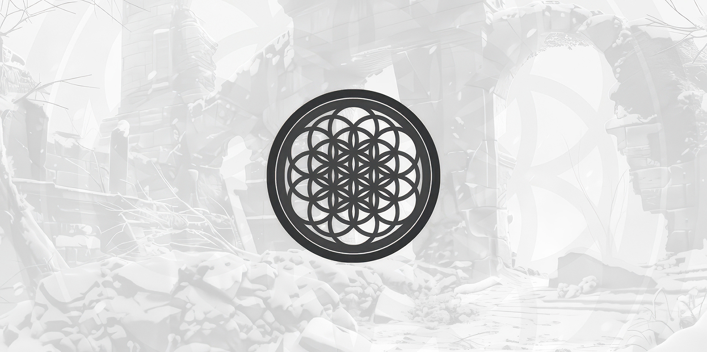

#

---

:::title
:spades: APOTHEOSIS CARD GAME :spades:
:::

:::content-center
:large_blue_square: Bruno Caxito :large_blue_square:
:::

---

O **APOTHEOSIS CARD GAME** é um de role-playing game (RPG) modular que combina elementos de RPG, deck building e batalha em um tabuleiro quadriculado, em um universo, estória e narrativa únicos.

Esta documentação detalha todas as regras, componentes e interações que compõem o jogo, servindo como referência tanto para jogadores quanto para desenvolvedores de conteúdo.

O sistema foi projetado para oferecer flexibilidade em diferentes estilos de campanha, permitindo partidas que variam de combates estratégicos a narrativas profundas baseadas em interpretação de personagens.

---

### Arquitetura do Sistema

Este jogo é construído sobre quatro pilares principais:

{{ arch(value) = '' + value + '' }}

{{ arch ':black_joker:' }} **Cartas e Baralhos**
:   Representam os elementos presentes no jogo, desde um objeto até uma ação ou evento. São também as "partes" utilizadas para construir os demais elementos do jogo.

{{ arch ':man-raising-hand:' }} **Heróis e Personagens**
:   Representam os jogadores, sendo compostos por um conjunto de cartas que definem suas características e estatísticas, permitindo a progressão durante o jogo ao mudar sua composição.

{{ arch ':game_die:' }} **Tabuleiro, Dados e Batalhas**
:   Define a movimentação e interações no espaço físico do jogo. É onde as batalhas são travadas, utilizando cartas e personagens para determinar o resultado de ações e embates.

{{ arch ':book:' }} **Narrativa, Objetivos e Testes**
:   Descreve o contexto, mundo e estória do jogo, bem como os objetivos e desafios que os jogadores devem superar para avançar. É o elemento que une os demais, fornecendo um propósito e significado para as ações dos jogadores.

> Cada um destes elementos é detalhado em seções específicas desta documentação.

 

!!!
Esta documentação está em constante atualização para refletir melhorias e novos conteúdos do sistema APOTHEOSIS CARD GAME. Para contribuições ou sugestões, entre em contato com a equipe de desenvolvimento.
!!!
