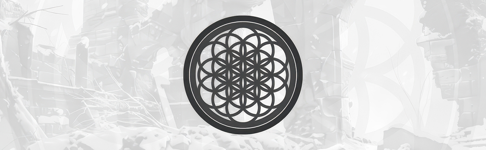

{.rounded-lg}

    
APOTHEOSIS CARD GAME

    
Criado por Bruno Caxito

    
<b>APOTHEOSIS CARD GAME</b> é um jogo de cartas modular que combina elementos de <i>role-playing game</i> (RPG), construção de baralho e batalha em um tabuleiro quadriculado, ambientado em um universo próprio com história e narrativa únicas.

    
Jogadores coletam cartas para compor seu personagem, que pode enfrentar desafios propostos por uma campanha narrativa ou batalhar contra os personagens de outros jogadores pela vitória.

---

<h2 style="text-align: center; margin-top: 3rem; margin-bottom: 1rem;">Arquitetura do Sistema</h2>

<svg style="width:0; height:0; position:absolute;" aria-hidden="true">
    <defs>
        <linearGradient id="icon-gradient" x1="0%" y1="0%" x2="100%" y2="100%">
            <stop offset="0%" stop-color="#673AB7" />
            <stop offset="100%" stop-color="#2196F3" />
        </linearGradient>
    </defs>
</svg>

    

        

            <svg class="pillar-svg" xmlns="http://www.w3.org/2000/svg" viewBox="0 0 24 24" stroke-linecap="round" stroke-linejoin="round">
                <rect x="3" y="7" width="13" height="14" rx="2" ry="2"></rect>
                <path d="M8 3h11a2 2 0 0 1 2 2v11"></path>
            </svg>
        

        
Cartas e Baralhos

        
O núcleo do jogo. Representam habilidades, itens, magias e eventos. Combine recursos e crie sinergias perfeitas para superar seus limites.

    

    

        

            <svg class="pillar-svg" xmlns="http://www.w3.org/2000/svg" viewBox="0 0 24 24" stroke-linecap="round" stroke-linejoin="round">
                <path d="M20 21v-2a4 4 0 0 0-4-4H8a4 4 0 0 0-4 4v2"></path>
                <circle cx="12" cy="7" r="4"></circle>
            </svg>
        

        
Heróis e Personagens

        
Você não é apenas um jogador, é um Herói. Evolua cartas de Classe, Casa e Ente para moldar um personagem com habilidades e atributos únicos.

    

    

        

            <svg class="pillar-svg" xmlns="http://www.w3.org/2000/svg" viewBox="0 0 24 24" stroke-linecap="round" stroke-linejoin="round">
                <rect x="3" y="3" width="18" height="18" rx="2" ry="2"></rect>
                <path d="M3 9h18M3 15h18M9 3v18M15 3v18"></path>
            </svg>
        

        
Tabuleiro e Batalhas

        
A ação acontece em um espaço quadriculado. O posicionamento, o controle de área e o alcance são tão vitais quanto as cartas que você escolhe jogar.

    

    

        

            <svg class="pillar-svg" xmlns="http://www.w3.org/2000/svg" viewBox="0 0 24 24" stroke-linecap="round" stroke-linejoin="round">
                <path d="M2 3h6a4 4 0 0 1 4 4v14a3 3 0 0 0-3-3H2z"></path>
                <path d="M22 3h-6a4 4 0 0 0-4 4v14a3 3 0 0 1 3-3h7z"></path>
            </svg>
        

        
Narrativa e Testes

        
Mergulhe em um mundo rico. Cumpra objetivos cooperativos contra ameaças em campanhas ou enfrente seus rivais nos competitivos modos de Arena.

    

[!ref Getting Started](/getting-started.md)

